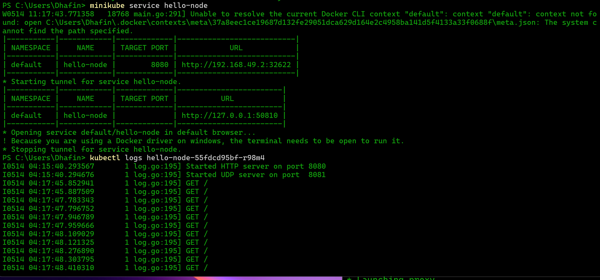
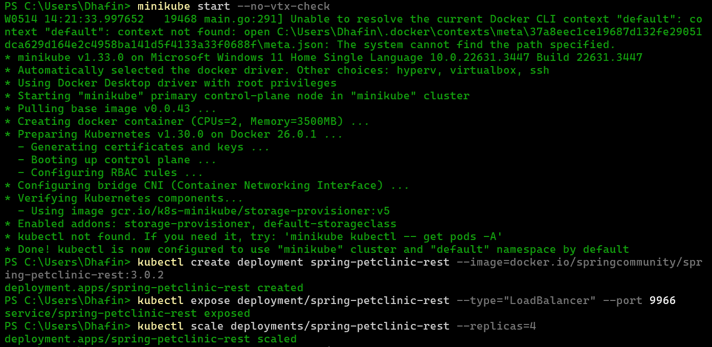
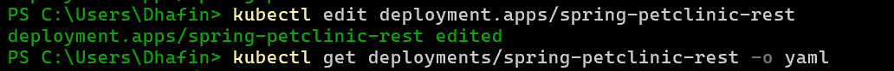
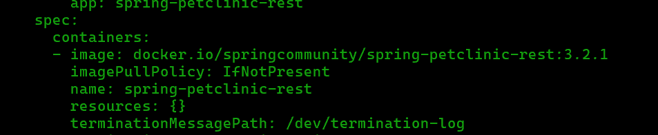
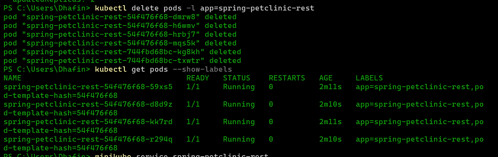
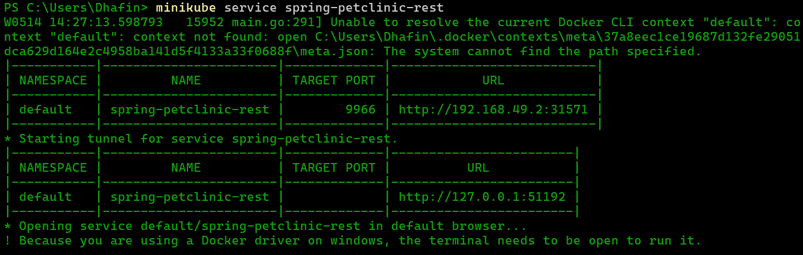
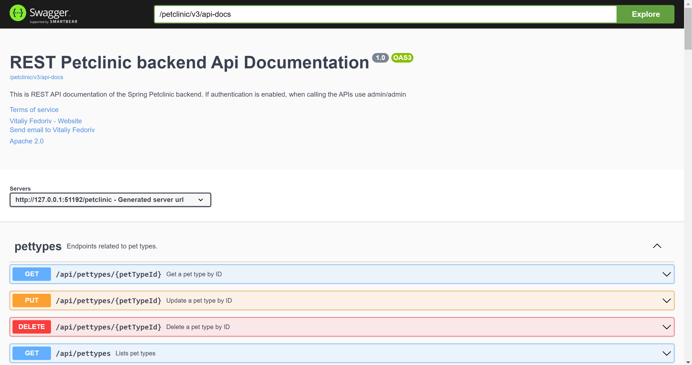
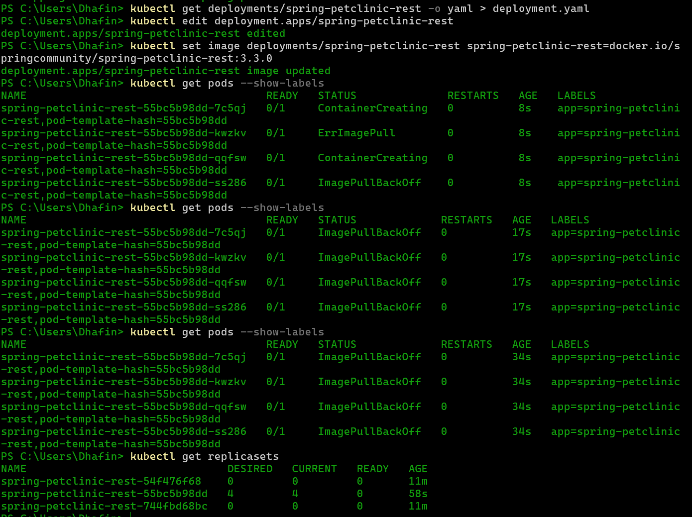
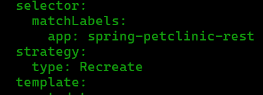

# Tutorial 11 - Reflections

## Hello MiniKube tutorial

### 1. Compare the application logs before and after you exposed it as a Service. Try to open the app several times while the proxy into the Service is running. What do you see in the logs? Does the number of logs increase each time you open the app?

Terdapat perbedaan setelah dijadikan service dimana pada address dan port sesuai device kita, aplikasi bisa menerima request beberapa kali. Request-request tersebut dicatat dalam log service hello-node:

### 2. Notice that there are two versions of `kubectl get` invocation during this tutorial section. The first does not have any option, while the latter has `-n` option with value set to `kube-system`. What is the purpose of the `-n` option and why did the output not list the pods/services that you explicitly created?

Penggunaan -n ini menyatakan bahwa service yang kita ingin gunakan berada pada namespace tersebut. Misalnya kita memiliki banyak service berbeda yang punya nama yanmg sama dan tersebar di banyak namespace maka argumen -n ini mengerucutkan untuk mendapatkannya dari namespace yang diberikan setelah -n.

## Rolling Update tutorial

### 1. What is the difference between Rolling Update and Recreate deployment strategy?

Rolling update strategy mengupdate pod dengan cara secara bertahap menggantikan versi yang lama dengan versi yang baru tanpa perlu take down semua pod sekaligus. Dengan ini memastikan tidak ada downtime saat update service berjalan. Sedangkan recreate kebalikannya, dimana dia take down terlebih dahulu semua pod dan kemudian create pod pod baru, hal tersebut berari ada downtime saat memperbarui versi aplikasi

### 2. Try deploying the Spring Petclinic REST using Recreate deployment strategy and document your attempt

buat deployment baru untuk rest petclicin

edit deployment yaml sampai berubah versi

saat di delete akan melakukan update sendirinya

saat di run

### 3. Prepare different manifest files for executing Recreate deployment strategy.

ganti image yang di set ke dalam container dan lihat lagi status dari pods yang berubah semuanya sekaligus sehingga tidak menggunakan rolling update.

### 4. What do you think are the benefits of using Kubernetes manifest files?
File manifest Kubernetes sangat penting untuk mendefinisikan dan mengelola sumber daya secara deklaratif, menawarkan berbagai manfaat seperti memungkinkan kontrol versi untuk pelacakan dan kolaborasi yang mudah, memastikan lingkungan dapat direproduksi untuk penyebaran yang konsisten di berbagai tahapan, dan memfasilitasi otomatisasi melalui jalur CI/CD. File-file ini meningkatkan kejelasan dengan berfungsi sebagai konfigurasi yang mendokumentasikan diri sendiri, memungkinkan kontrol yang tepat atas alokasi sumber daya dan pengaturan keamanan, serta meningkatkan portabilitas dengan menyediakan format standar yang dapat digunakan di berbagai kluster Kubernetes. Secara keseluruhan, file-file ini sangat penting untuk menjaga lingkungan Kubernetes yang kuat, skalabel, dan aman.